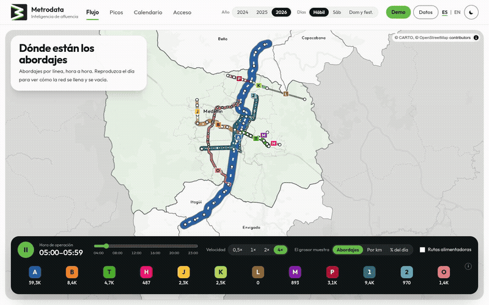
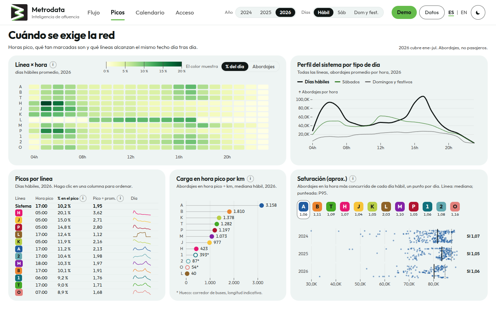
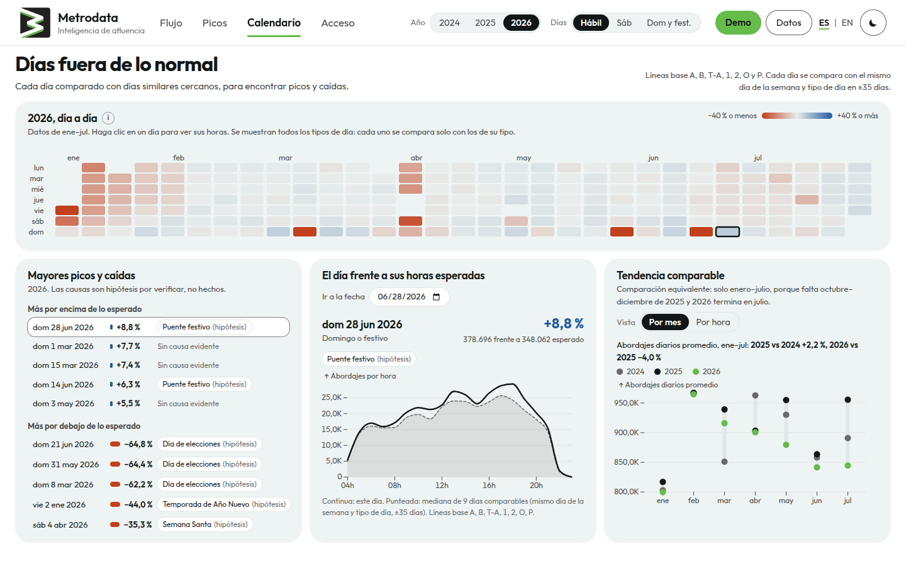
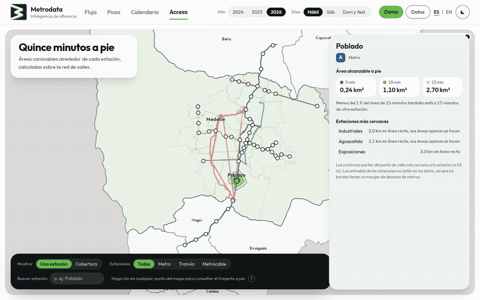
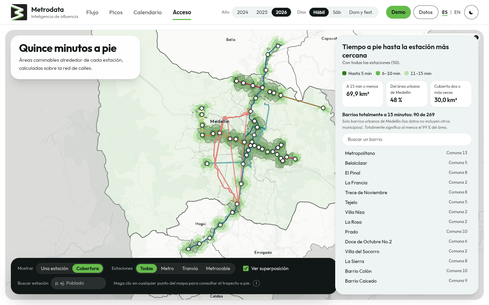

<div align="center">


# Metrodata

**Ridership intelligence for the Metro de Medellín**

Hourly boardings on 12 lines, January 2024 to July 2026 · Spanish and English

[Live demo](https://metrodata.vercel.app) · [Overview](#overview) · [Requirements](#requirements) · [Quick start](#quick-start)

<br/>



<sub>A weekday in motion: each line swells with its boardings, hour by hour.</sub>

</div>

---

## Overview

Metrodata is an interactive dashboard that turns the Metro's open ridership data into four answers:

| Page | Question |
|---|---|
| **Flujo** | Which lines carry the most people, and when? |
| **Picos** | When does the network strain, and which lines hit the same ceiling every day? |
| **Calendario** | Which days broke the pattern, and why might that be? |
| **Acceso** | How much of the city lives within a 15-minute walk of a station? |

A guided **Demo** button walks through the whole story. Figures are boardings (not passengers), and comparisons between years use January–July only.

<p align="center">
  
  <br/><sub>Peaks: rush hours, how sharp they are, and which lines run at their ceiling.</sub>
</p>

<p align="center">
  
  <br/><sub>Calendar: every day compared with similar days; election Sundays stand out in red.</sub>
</p>

<p align="center">
  
  <br/><sub>Access: real walking areas around each station, computed on the street network.</sub>
</p>

<p align="center">
  
  <br/><sub>Coverage: 48% of Medellín's urban area is within 15 minutes on foot of a station.</sub>
</p>

## Requirements

- Node.js 20.19+ (developed on 24)
- [uv](https://docs.astral.sh/uv/) with Python 3.12
- Docker, only to recompute the walking areas (see [`docs/isochrones.md`](docs/isochrones.md))

## Quick start

```bash
npm install
uv sync
npm run data    # build public/data/ from data/ (walking areas: see docs/development.md)
npm run dev     # http://localhost:5173
```

Run the tests with `npm test` and `npm run test:py`. Publish with `npm run deploy`. Checks, data regeneration and deploy details are in [`docs/development.md`](docs/development.md).

<div align="center">
<br/>
<sub>Data: Metro de Medellín and Alcaldía de Medellín open data · © OpenStreetMap contributors · © CARTO</sub>
</div>
